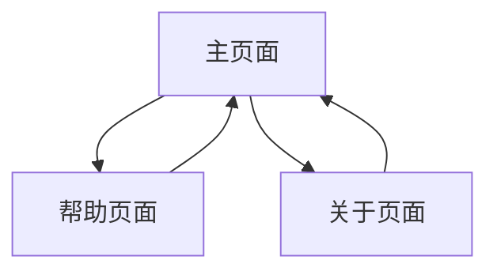

## 1. Product Overview

IntelliRename 是一个智能文档重命名 Web 应用，利用 AI 技术将杂乱的文档批量转化为条理清晰、易于检索的知识资产。
- 解决用户文档命名混乱、检索困难的痛点，通过 AI 自动生成有意义的文件名，提升知识管理效率。
- 目标用户为需要管理大量文档的知识工作者、学生和企业用户，帮助他们建立有序的数字资产库。

## 2. Core Features

### 2.1 User Roles
由于是简单的工具型应用，不需要复杂的用户角色区分，所有用户都具有相同的功能权限。

### 2.2 Feature Module
我们的 IntelliRename 应用包含以下核心页面：
1. **主页面**：文件上传区域、重命名预览表格、操作控制面板
2. **帮助页面**：使用说明、功能介绍、常见问题
3. **关于页面**：项目介绍、技术说明、联系方式

### 2.3 技术架构

#### 2.3.1 前端 (Frontend)
- **职责**: 负责与用户直接交互，运行在用户的浏览器中
- **技术栈**: HTML5 + CSS3 + JavaScript (Vanilla)
- **UI框架**: Bootstrap 5.3.7 (通过CDN引入)
- **核心组件**:
  - 美观直观的文件上传区域，支持拖拽和点击选择多个文件
  - 进度条或状态指示器，提供文件上传和处理的即时反馈
  - 清晰的结果展示表格，包含三列：原文件名、AI建议新名、操作
  - AI建议新名列支持用户直接在线编辑，进行微调
  - 最终确认和下载按钮："一键重命名并打包下载"

#### 2.3.2 后端 (Backend)
- **职责**: 负责处理所有服务端逻辑，在服务器上运行
- **技术栈**: Python 3.9+ + FastAPI
- **核心组件**:
  - API端点 `/upload` 用于接收前端上传的文件
  - 文件处理逻辑，读取上传文件的内容
  - AI API交互模块，与Gemini API通信获取建议的新文件名
  - 文件打包模块，在服务器端生成重命名后的文件副本并打包成ZIP
  - API端点 `/download/{job_id}` 用于前端下载生成的ZIP文件

### 2.3 Page Details

| Page Name | Module Name | Feature description |
|-----------|-------------|---------------------|
| 主页面 | 文件上传区域 | 支持拖拽上传多个文档文件，显示上传进度和文件列表 |
| 主页面 | AI 重命名处理 | 调用 AI API 分析文档内容，生成智能文件名建议 |
| 主页面 | 预览编辑表格 | 展示原文件名和 AI 建议的新文件名，支持在线编辑修改 |
| 主页面 | 批量操作控制 | 提供全选、重置、确认重命名等批量操作功能 |
| 主页面 | 文件下载 | 生成重命名后的文件 ZIP 包供用户下载 |
| 帮助页面 | 使用指南 | 详细的操作步骤说明和功能介绍 |
| 帮助页面 | 常见问题 | 用户常遇问题的解答和故障排除 |
| 关于页面 | 项目信息 | 应用介绍、技术架构和开发团队信息 |

## 3. Core Process

用户的主要操作流程如下：
1. 用户访问主页面，通过拖拽或点击上传多个文档文件
2. 系统自动调用 AI API 分析每个文件内容，生成智能文件名
3. 用户在预览表格中查看 AI 建议的新文件名，可进行在线编辑修改
4. 用户确认所有文件名后，点击生成下载包
5. 系统创建包含重命名文件的 ZIP 包供用户下载

## 4. User Interface Design

### 4.1 Design Style
- 主色调：现代蓝色 (#2563eb) 和清新绿色 (#10b981)
- 辅助色：浅灰色背景 (#f8fafc) 和深灰色文字 (#374151)
- 按钮样式：圆角设计，悬停效果，主要按钮使用渐变色
- 字体：系统默认字体栈，标题 18-24px，正文 14-16px
- 布局风格：卡片式设计，顶部导航栏，响应式网格布局
- 图标风格：简洁的线性图标，支持文件类型识别图标

### 4.2 Page Design Overview

| Page Name | Module Name | UI Elements |
|-----------|-------------|-------------|
| 主页面 | 文件上传区域 | 虚线边框的拖拽区域，上传图标，进度条，文件列表卡片 |
| 主页面 | 预览编辑表格 | 清晰的表格布局，可编辑输入框，文件类型图标，操作按钮 |
| 主页面 | 操作控制面板 | 醒目的主要操作按钮，批量选择复选框，状态指示器 |
| 帮助页面 | 使用指南 | 步骤式布局，配图说明，折叠式 FAQ 区域 |
| 关于页面 | 项目信息 | 简洁的介绍文字，技术栈展示，联系方式卡片 |

### 4.3 Responsiveness
应用采用移动优先的响应式设计，在桌面端提供完整功能体验，在移动端优化触控操作和布局适配。

## 5. 用户工作流程

### 5.1 详细操作流程
1. **打开网页**: 用户在浏览器中打开应用的网址
2. **上传文件**: 用户将一个或多个（一次性最多10个）.txt/.md文件拖拽到上传区域
3. **处理过程**: 前端显示"正在智能分析中..."，并将文件发送到后端
4. **审查与微调**: 后端处理完毕后，页面上出现表格，用户可以看到所有文件的原名和AI建议的新名，可直接在表格的输入框中修改
5. **确认下载**: 用户点击"确认并下载"按钮
6. **获取结果**: 浏览器开始下载名为 `renamed_files.zip` 的压缩包
7. **完成**: 用户在本地解压ZIP包，得到所有已经按新名字命名好的文件，原文件在用户本地保持不变

## 6. MVP开发计划

### 6.1 开发阶段
1. **搭建后端基础**:
   - 使用FastAPI搭建基础Web服务器
   - 创建API端点 `/upload`，接收前端上传的单个文件

2. **集成AI核心逻辑**:
   - 在 `/upload` 端点中集成调用AI API的逻辑
   - 读取上传文件内容，发送给AI，返回新文件名作为API响应

3. **创建前端界面 (V1)**:
   - 创建简单的HTML页面，包含 `<input type="file">` 和按钮
   - 编写JavaScript，实现文件选择后调用后端 `/upload` API，显示返回的新文件名

4. **实现核心功能闭环**:
   - 升级后端逻辑处理多个文件
   - 实现文件打包功能：将重命名后的文件副本存入ZIP文件流
   - 创建API端点 `/download/{job_id}` 用于下载ZIP包

5. **完善前端界面 (V2)**:
   - 实现拖拽上传功能
   - 实现结果预览表格，加入可编辑的输入框
   - 实现最终的"确认下载"流程，按钮请求下载API

### 6.2 技术选型说明
- **后端框架**: FastAPI（推荐）- 性能极高，自带交互式API文档(Swagger UI)，适合快速开发API服务
- **前端方案**: 无框架方式 - HTML + CSS + JavaScript，使用Bootstrap快速获得专业外观
- **未来扩展**: 如应用变得复杂，可考虑引入Vue.js或React等现代前端框架